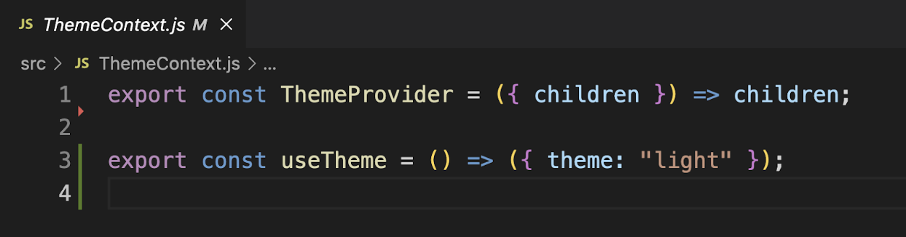
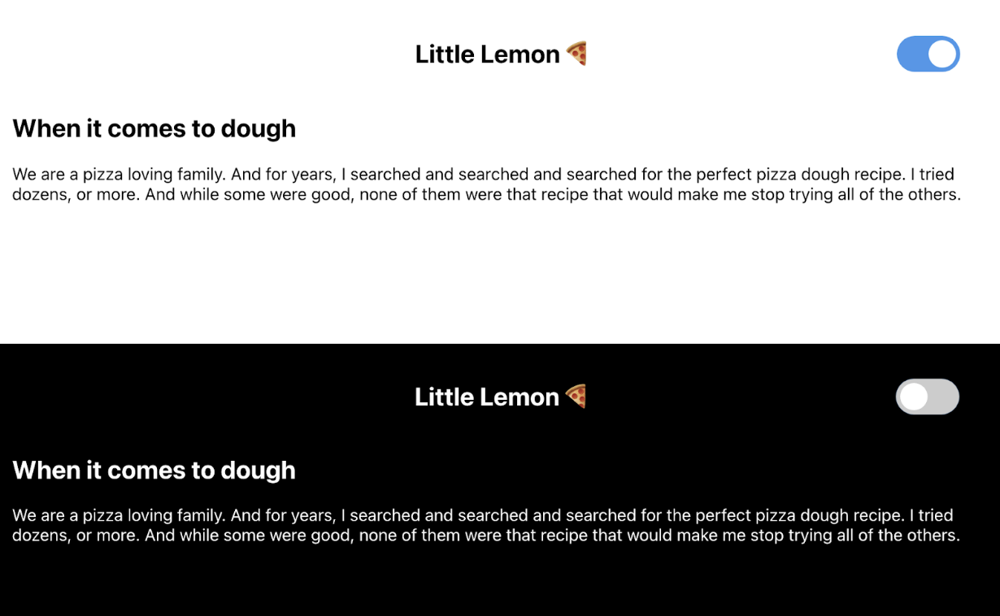

# Instructions

## Task

You've learned about React Context and how it allows you to define global state without passing individual props down through each component.
One of the most common use cases for Context is to define a theme for your application. In this exercise, you'll create a light/dark theme switcher.

The starter code includes all the necessary UI elements, as well as switch component to toggle the theme. Your goal is to implement the missing functionality inside `ThemeContext.js`.
`ThemeContext` already exports a `ThemeProvider` component and a `useTheme` hook.
At the moment, they don't do anything and return dummy values. 

You'll need to implement both `ThemeProvider` component and `useTheme` hook inside `ThemeContext.js` file to complete this exercise.

`ThemeProvider` should render a context provider component and inject as the context value an object with 2 properties: a `theme` property that is a string that can be either `light` or `dark` and a function named `toggleTheme` that allows to toggle the theme. 
`useTheme` hook should return that context object.

**Note:** Before you begin, make sure you understand how to work with the Coursera Code Lab for the [Advanced React course](https://www.coursera.org/learn/advanced-react/supplement/htaLX/working-with-labs-in-this-course).

If you run `npm start` and view the app in the browser, you'll notice that the starting React app works as is.
The app outputs a simple view with a header, page and a switch widget in the top right corner to change the theme.

## Steps

### **Step 1**

Open the `ThemeContext.js` file.

Create a `ThemeContext` object using `React.createContext()`

Implement the `ThemeProvider` component. It should accept a `children` prop and return a `ThemeContext.Provider` component.
The `ThemeContext.Provider` receives an object as its `value` prop, with a `theme` string and a `toggleTheme` function.

`toggleTheme` should toggle the theme between `light` and `dark`.

### **Step 2**

Implement the `useTheme` hook. It should return the `theme` and `toggleTheme` values from the `ThemeContext`.

### **Step 3**

Open the `Switch/index.js` file. Add an `onChange` prop to the input element and pass as the event handler a callback function to change the theme.
You don’t need to use the event argument in this case.

### **Step 4**

Verify that the app works as expected. You should be able to toggle the theme between light and dark.
Notice how the background color of the page changes, as well as the color of the text.

