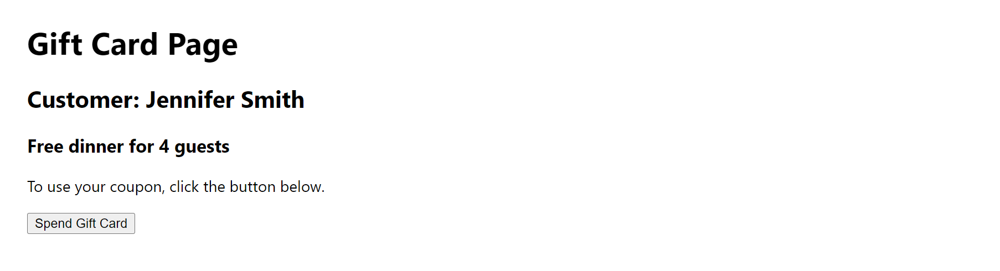
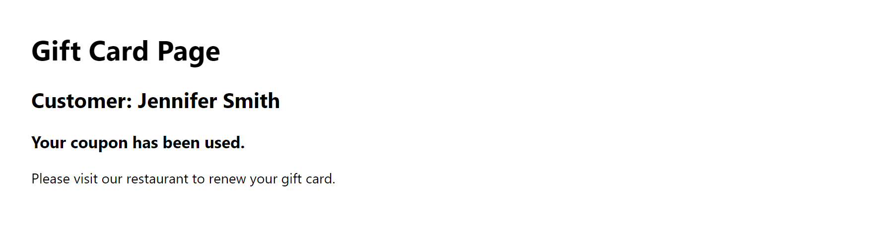

# Instructions

## Task

You've revised the useState hook. You've also learned about working with primitive (string) data and complex data (state stored in objects).

In this code lab, you'll practice updating the state stored in an object, based on the user interacting with the app.

This code lab's app shows the Gift Card page of the Little Lemon Restaurant app, where a visitor initially has a Gift Card that they can use to have dinner for four.

The starter code shows the following information on the screen:



In other words, the text that shows on the screen is as follows:
* A title of "Gift Card Page",
* The name of the recipient, that in this case, says "Customer: Jennifer Smith",
* A descriptor of the state of the gift card, which is "Free dinner for 4 guests"
* Body text that states, "To use your coupon, click the button below"

The "Spend Gift Card" button is set up to execute a function when clicked. However, that event-handling function is empty.

That means that when serving the app with the starter code, if you click the "Spend Gift Card" button, there will be no change on the screen.

Your task is to complete the event-handling function for the "Spend Gift Card" button clicks, as detailed in the steps below.

When the code lab is successfully completed, after the "Spend Gift Card" button is clicked, the UI should update to show the following information on the screen:



In other words, the text that shows on the screen is as follows:
* The title of Gift Card Page
* The name of the recipient, that in this case, says "Customer: Jennifer Smith"
* A descriptor of the state of the gift card, which is "Your coupon has been used", and
* Body text that states, "Please visit our restaurant to renew your gift card"

**Note:** Before you begin, make sure you understand how to work with the Coursera Code Lab for the [Advanced React course](https://www.coursera.org/learn/advanced-react/supplement/htaLX/working-with-labs-in-this-course).

## Steps

### **Step 1**

Open the `App.js` file.

Locate the `spendGiftCard()` function.

Inside the `spendGiftCard()` function, invoke the `setGiftCard()` state-updating function. For now, just invoke it, without passing it any parameters or doing anything else with it.

### **Step 2**

Inside the `setGiftCard()` function invocation's parentheses, pass in an arrow function.

This arrow function has a single parameter, named `prevState`. After the arrow, add a block of code (starting with an opening curly brace, and ending with a closing curly brace two lines below).

### **Step 3**

In Step 2, you've added the previous state object as the `prevState` argument of the arrow function you passed to the `setGiftCard()` function.

Now you need to return a new object based on this previous state object.

For now, in Step 3, you need to just return a copy of the `prevState` object.

That means that you need to use the `return` keyword and a copy of the `prevState` object, using the rest operator - that is, the `...` operator.

### **Step 4**

In Step 3, you returned a copy of the `prevState` object using the rest operator.

Now you need to combine this copy of the `prevState` object with those properties that you want updated.

Put differently, you need to update some of the key-value pairs that already exist on the state object that were initially passed to the `useState()` function call.

For now, in Step 4, update the `text` property of the state object, as follows:
```js
text: "Your coupon has been used."
```

### **Step 5**

In Step 4, you've updated the `text` property on the state object.

In this step, you need to update the remaining properties on the state object.

You need to update the `valid` key's value to `false`.

You need to update the `instructions` key's value to `Please visit our restaurant to renew your gift card.`.

### Conclusion

Save the changes and serve the app.

Verify that the completed app, once saved and served, behaves as follows:
1. Initially, the Spend Gift Card button is showing.
2. Once you click the Spend Gift Card button, the `text` property value's update will now display the sentence that reads "Your coupon has been used".
3. Additionally, the `instructions` key's value update will now display the text that reads "Please visit our restaurant to renew your gift card."
4. Finally, since the `valid` key's value was updated to `false`, the button is no longer showing.
