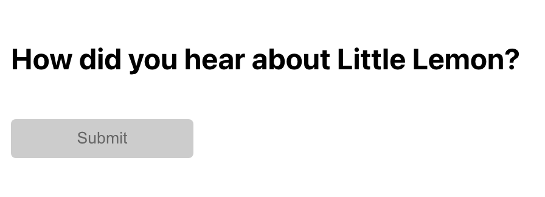

# Instructions

## Task

You've learned about some advanced React APIs, `React.cloneElement` and `React.Children.map` that allow you to modify the children of a component dynamically.
In this exercise, you'll use these APIs to build a `RadioGroup` component.

On HTML, an input of type `radio` offers a `checked` property to determine whether a radio button is selected or not.

When building a radio group in React, in other words, a component that represents a set of choices where only one can be selected at a time, an initial implementation might look like this:

```jsx
  <RadioOption checked={false} onChange={handleOnChange} value="1" />
  <RadioOption checked={true} onChange={handleOnChange} value="2" />
  <RadioOption checked={false} onChange={handleOnChange} value="3" />
```

However, this approach is not ideal because it requires the user of the component to keep track of the state of each radio button,
as well as setting state change handlers for each option.

Wouldn't it be great to remove any redundancies and reduce the state to the bare minimum while still keeping the functionality intact? 
Well, this is a great example where component composition shines and enables developers to use a more intuitive and simpler set of props to define a component's API.

Instead of having the user of the component to keep track of the state of each radio button,
you can have a parent RadioGroup component that is aware of the current selection and provides a handler to manage any selection change,
without you having to explicitly pass the `checked` and `onChange` props to each `RadioOption` component.

The RadioGroup component can then leverage the `children` prop and use both `React.cloneElement` and `React.Children.map` to internally pass the `checked` and `onChange` props to each `RadioOption` child.

```jsx
<RadioGroup selected={selectedValue} onChange={handleOnChange}>
  <RadioOption value="1" />
  <RadioOption value="2" />
  <RadioOption value="3" />
</RadioGroup>
```

In this exercise, you are going to implement this exact component API.

**Note:** Before you begin, make sure you understand how to work with the Coursera Code Lab for the [Advanced React course](https://www.coursera.org/learn/advanced-react/supplement/htaLX/working-with-labs-in-this-course).

If you run **npm start** and view the app in the browser you'll notice that the starting React app works as is.
The app outputs a simple view with a header and a submit button, but no radio options yet.



## Steps

### **Step 1**

Open the `App.js` file. In there you will already see the desired API for the `RadioGroup` and `RadioOption` components.
At the moment, they don't render anything on the screen. You don't have to change anything in this file, but just understand the set of props involved in the component design.

### **Step 2**

Open the `Radio/index.js` file. Implement the remaining bits for the `RadioGroup` component. The RadioOptions variable is initially set to `null`.
Instead, use `React.Children.map` to iterate over the `children` and clone each child using `React.cloneElement`. The result should be assigned to the `RadioOptions` variable.

Each cloned child should receive two additional props, `checked` and `onChange`.

### **Step 3**

Open the `Radio/index.js` file. The `RadioOption` component is incomplete. In particular, it's missing some props in the input element that it renders: `value`, `checked` and `onChange`.

The `RadioOption` component already receives all those props. Your goal is to connect them to the input element.

When adding the `onChange` prop to the radio input, which represents the event that gets triggered whenever you interact with it, you can access the `value` property of the event target to get the value of the newly selected radio option, as per the code below.

```jsx
const handleChange = (e) => {
  const newValueSelected = e.target.value
}
```

### **Step 4**

Verify that the app works as expected. You should be able to select a radio option and see how the submit button gets enabled as soon as a selection is made.

### **Tips**
The `RadioGroup` component receives the `selected` prop, a string that represents the value of the currently selected radio option.
However, an individual `RadioOption` component only cares about whether it is selected or not, via the boolean`checked` prop.
You would have to perform some small business logic inside the `RadioGroup` component to translate the `selected` prop to the `checked` prop that each `RadioOption` child receives.
