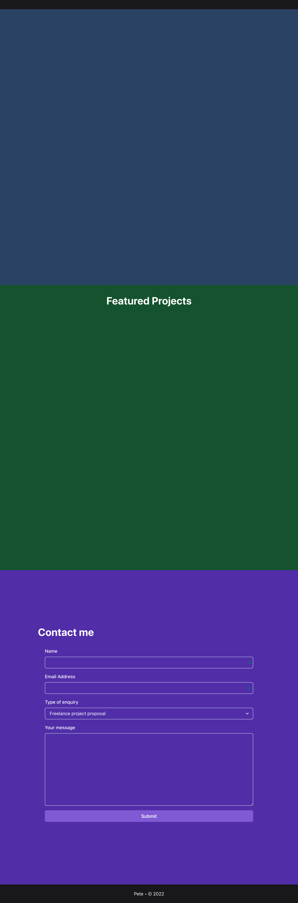
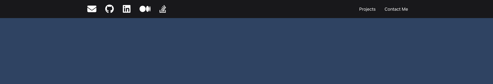
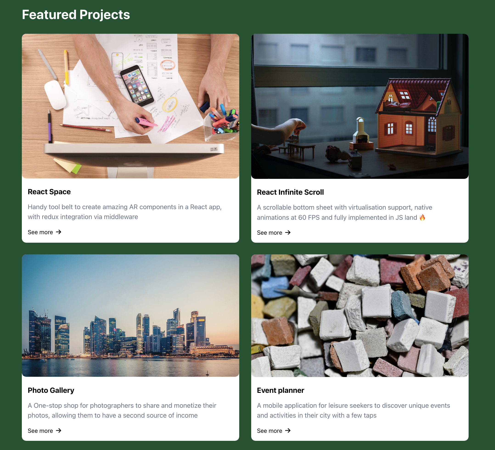
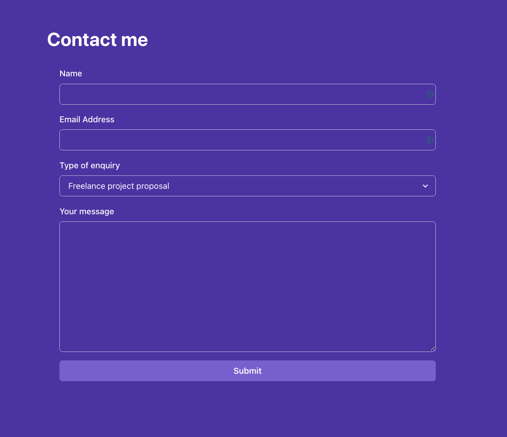
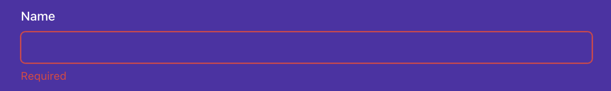
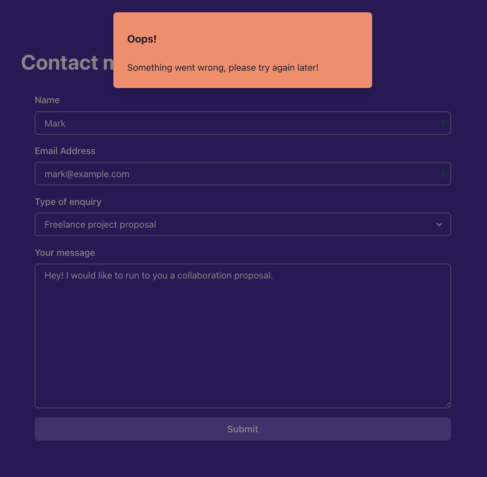
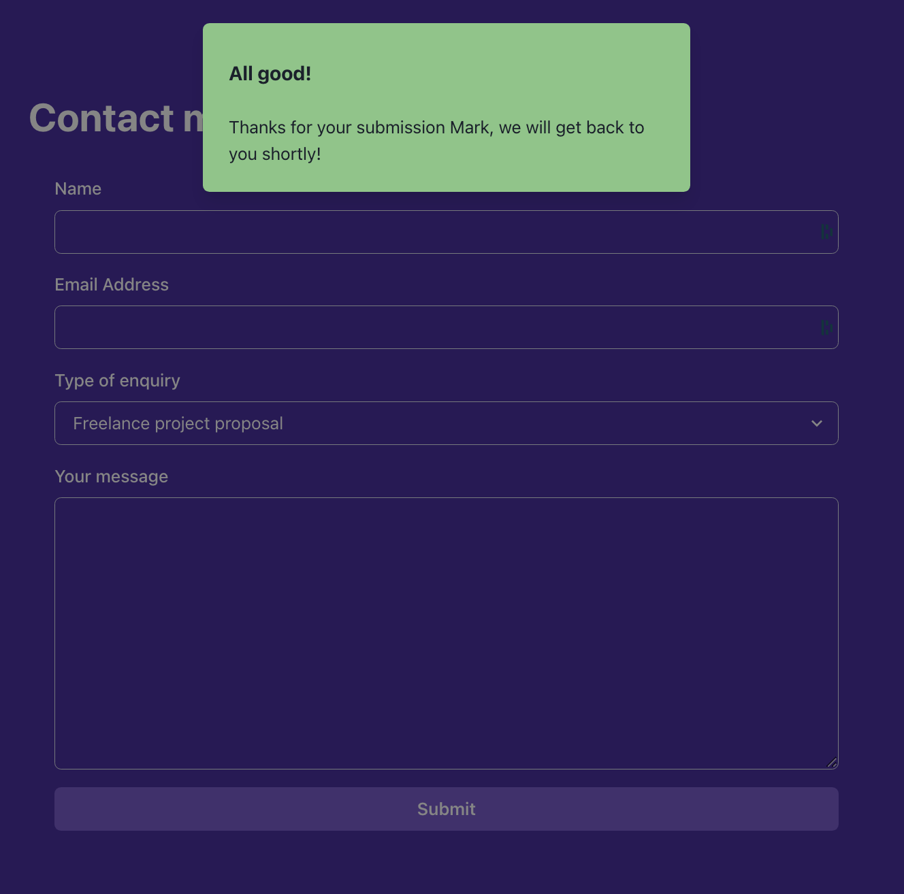

# Instructions

## Task

In this final lab, you are going to create a portfolio page for yourself. You will be using the skills you have learned in this course to create a page that showcases your work.
The portfolio page will be a single page that will contain the following sections:

- A header with external links to social media accounts and internal links to other sections of the page
- A landing section with an avatar picture and a short bio
- A section to display your featured projects as cards in a grid fashion
- A contact me section with a form to allow visitors to contact you

Here you will have the opportunity to use some popular open source libraries that will help you to have a more polished and professional looking page.

Before proceeding further, let's provide an introduction to the libraries you will be using.

### Libraries

#### Chakra UI

Chakra UI comes pre-configured with this lab, so you don't have to worry about installing it or setting it up.

The components from this library you will need to use are already imported from the `@chakra-ui/react` package at the top of each corresponding file.
If you don't see a component already imported, it's because you probably won't need it.
In any case, feel free to check their official [documentation](https://chakra-ui.com/docs/components) to see all the components at your disposal and their corresponding props.

#### Formik and Yup

The Formik library is already set up in the project as well, so no extra configuration is needed.
In this lab, you will be only using the `useFormik` hook from the Formik library, as well as the global `Yup` object to define the Contact Me form validation rules.

The form UI will be implemented using Chakra UI components.

Before you begin, if you run `npm start` and view the app in the browser, you'll notice that the starting React app works as is.

The app outputs a page with an empty header, 3 different full-height sections and a footer.
Every section has a different background color. The first 2 sections will be empty and the third section will contain all the UI elements for the Contact Me form.

## Steps

Once you open the code lab, you need to install the *Chakra UI* and other referenced libraries by running the `npm install` command from the built-in terminal in the code lab. To toggle the built-in terminal, you need to click the View menu item, then choose the Terminal in the dropdown.

Once the terminal is open (visible), you can run the `npm install` command. This will install all the required missing dependencies, so that you can begin working on the task.

### **Step 1**

Open `Header.js` file. You will see a header component with black background, but no content.

a) **Add external social media links to the header on the left side of the page**.

The implementation should be placed inside the first `nav` element. The data is already provided in the `socials` array at the top of the file.

Use the `HStack` component to stack the links horizontally.
Each social should be a `a` tag with a `href` attribute pointing to the corresponding social media page. The `a` tag should have as children a `FontAwesomeIcon` component, which is already imported for you.

The `FontAwesomeIcon` component takes 2 props:
- `icon`: The icon to be displayed. In this case, you should use the `icon` prop from the `social` object.
- `size`: The size of the icon. You can use the `2x` value.

You can check below an example of how to render it:

`<FontAwesomeIcon icon="fab" size="2x" />`

b) **Add internal links to the Projects section and Contact Me section**

Each link should be a `a` tag. Each `a` tag should have as children the name of the section: "Contact Me" and "Projects".
When clicking on the link, the url should show the corresponding section. For example, when clicking on the "Contact Me" link, the url path should be `/#contact-me`.
Also, the click should scroll to the corresponding section with a smooth animation. The code for that has been provided for you via the `handleClick` function. You need to hook that function with the `a` tag `onClick` event.
Bear in mind the Projects section has an id called `projects-section` and the Contact Me section has an id called `contactme-section`.

Avoid any key related warnings when opening the console.

The final header UI should look like below:

### **Step 2**

Open the `LandingSection.js` file. Implement the below UI to provide a landing section for the app with an avatar, a greeting and a brief role description.
For the data, use the variables provided at the top of the file (`greeting`, `bio1` and `bio2`) and not personal data.
For the avatar you can use the next url: `https://i.pravatar.cc/150?img=7`
All the components you need have been already imported for you.

### **Step 3**

Open the `ProjectsSection.js` component. This component is already implemented, however the `Card` component that it uses to display information about each project it's not.
The `ProjectsSection` component already defines a `projects` array with the data for each project and that information is passed to each `Card` component as props.

Open the `Card.js` component and implement the UI for the card. Each card should look like the image below:

You can use the following components from Chakra UI that have been already imported for you:
- HStack,
- VStack,
- Image,
- Heading,
- Text,

For the right arrow, use the below component. The necessary imports are already provided for you as well.
`<FontAwesomeIcon icon={faArrowRight} size="1x" />`

Avoid any key related warnings when opening the console.

### **Step 4**

Open the `ContactMeSection.js` component. Implement the remaining requirements of the form according to the below specifications.

The form contains 4 input fields: name, email address, type of enquiry and message.

The whole UI of the form is defined for you. You need to implement some missing business logic.

a) **Add the proper configuration to the `useFormik` hook, passing an object with 3 properties**: `initialValues`, `onSubmit` and `validationSchema`. 

The `initialValues` object should have the following fields:
- `firstName`: The name of the user
- `email`: The email of the user
- `type`: 'hireMe' | 'openSource' | 'other'
- `comment`: A message from the user

The `onSubmit` function should perform an API call by using the `submit` helper from `useSubmit` hook. 
Inspect the `useSubmit` custom hook to see the arguments the `submit` function expects.

The `validationSchema` should be a Yup schema that validates the form fields. The validation rules are as follows:
- `firstName`: required field. Otherwise, the error message should be "Required".
- `email`: required field and a valid email. If empty, the error message should be "Required". If not a valid email, the error message should be "Invalid email address".
- `type`: Optional field
- `comment`: required field and with a minimum of 25 characters. If empty, the error message should be "Required". If less than 25 characters, the error message should be "Must be at least 25 characters".

b) **Make the `Input` components from Chakra UI controlled components**.

`useFormik` hook returns an object with a function called `getFieldProps` that when called, returns an object with the necessary props to make the input controlled.

c) **Show the error messages for each field when the field is touched and the validation fails**. 

Each field is grouped in a `FormControl` component. The `FormControl` component takes a `isInvalid` prop that you can use to show the error message.

The `isInvalid` prop should be `true` when the field is touched and the validation fails.

The `FormErrorMessage` component from Chakra UI should display the corresponding error message if the `isInvalid` prop from the parent `FormControl` component is true.

Below is an example of how the UI should look like when the validation fails for the `firstName` field:

d) **Connect the `form` onSubmit prop with Formik's `handleSubmit` function.**

Make sure the default HTML form behaviour is prevented when a submission occurs.

e) **Show an alert when the form is submitted successfully**.

You need to listen to changes in the `response` object from the `useSubmit` hook. Also, when the form is submitted, a loading indicator should be shown in the Submit button. You can use the `isLoading` property from the `useSubmit` hook.

The `useSubmit` hook is implemented in a way that 50% of the times it will return a successful response and 50% of the times it will return an error response.

The `response` object from the API has 2 properties:
- `type`: 'success' | 'error'
- `message`: Extra contextual information about the response

You can use the provided `useAlertContext` hook to show the alert. The hook returns a function named `onOpen` that you can call to display it.

Check the `alertContext.js` file to see the arguments the `onOpen` function expects.

If the response is successful, the alert should display in its content the first name of the user, according to the value typed in the form 1st field, so make sure you are passing the right arguments to the `submit` function returned from the `useSubmit` hook.

In addition, the form has to be reset if the response is successful. For that use the `resetForm` function from the object returned from the `useFormik` hook.

This is how the UI should look for both cases:

### **Step 5 (bonus)**

Implement a header show/hide animation depending on the scroll direction.
The header should slide up with some animation and be hidden when scrolling down the page.
When scrolling up, the header should slide down and be visible.

For that, the outermost Box component has some transition properties already defined. Your logic should change the `transform` property of the underlying `Box` DOM element depending on the scroll direction.

When scrolling up, the `transform` style property from the `Box` DOM element should be `translateY(0)`.
When scrolling down, the `transform` style property from the `Box` DOM element should be `translateY(-200px)`.

Here are some of the elements you may need for the implementation:
- The `useEffect` hook
- The `useRef` hook
- Setting up listeners for the scroll event `window.addEventListener('scroll', handleScroll)`
- Removing listeners for the scroll event: `window.removeEventListener('scroll', handleScroll)`
- Keeping track of the previous scroll position in a variable

